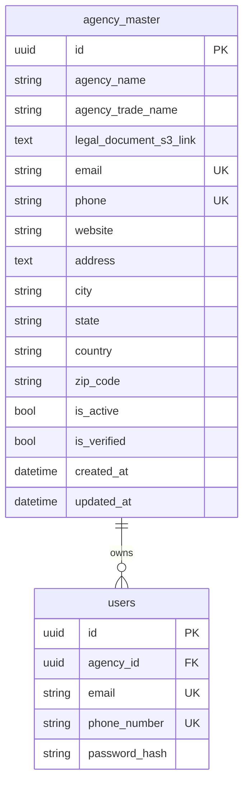

# Agency Registration Module

## Endpoints

- `POST /api/v1/agency/register` creates an agency and first `admin` user. It supports JSON with an existing `legal_document_s3_link`, or `multipart/form-data` with a PDF upload.
- `POST /api/v1/agency/login` logs in an agency admin using the local bcrypt password hash.
- `POST /api/v1/agency/upload-document` returns a presigned S3 upload URL for the legal document.
- `GET /api/v1/agency/list` lists agencies visible to the current user.
- `GET /api/v1/agency/{agency_id}` returns one agency.
- `PUT /api/v1/agency/{agency_id}` updates one agency.
- `DELETE /api/v1/agency/{agency_id}` deletes one agency.

## Registration Request

### Multipart Form

Send `multipart/form-data` fields:

- `email`
- `phone_number` (legacy alias `phone` still accepted)
- `agency_name`
- `agency_trade_name`
- `password`
- `legal_document` as a PDF file
- optional `address`, `city`, `state`, `country`, `zip_code`/`zipcode`, `website`

The PDF is uploaded to S3 at:

```txt
{agency_id}/profile_doc/{uploaded_pdf_filename}
```

S3 folders are virtual; the code does not create duplicate folders. Uploading the same filename for the same agency overwrites the object key.

### JSON Compatibility

Existing clients may still send JSON with `legal_document_s3_link` already populated.

## Registration Response

The response follows the project `StandardResponse` envelope and includes `agency` and `user`.
It does not return a token, matching `POST /api/v1/auth/signup`. Use `POST /api/v1/agency/login` to receive a token.

## Auth Model

Existing Cognito authentication remains unchanged. Agency registration uses a local bcrypt password hash stored on `users.password_hash` and issues an HS256 access token with `auth_provider=agency`. The existing `get_current_user` dependency accepts both Cognito access tokens and agency tokens.

## Access Rules

- `super_admin` can manage all agencies.
- `admin` users linked to an agency can manage only their own `agency_id`.
- legacy `admin` users without an `agency_id` can manage all agencies.

## ER Update


