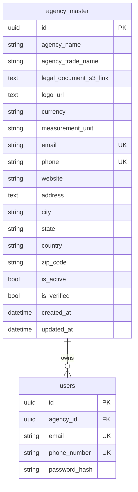

# Agency Registration Module

## Endpoints

- `POST /api/v1/agency/register` creates an agency and first `admin` user.
  - **JSON:** `file_name`, `content_type`, optional `file_size` — same presigned-PUT pattern as `POST /auth/me/profile-picture`.
  - **Multipart:** optional server-side PDF upload (field `legal_document`, `legal_document_file`, or `legal_document_s3_link`).
- `POST /api/v1/agency/login` logs in an agency admin using the local bcrypt password hash.
- `POST /api/v1/agency/upload-document` returns a presigned S3 **PUT** URL and persists the canonical public URL on the agency row.
- `POST /api/v1/agency/{agency_id}/logo` — upload/replace agency logo (presigned PUT or multipart server upload).
- `GET /api/v1/agency/{agency_id}/logo` — presigned GET URL for the stored logo.
- `DELETE /api/v1/agency/{agency_id}/logo` — remove logo from S3 and set `logo_url` to NULL.
- `GET /api/v1/agency/list` lists agencies visible to the current user.
- `GET /api/v1/agency/{agency_id}` returns one agency (includes `currency`, `measurement_unit` from `agency_master`).
- `PUT /api/v1/agency/{agency_id}` updates one agency (JSON fields, optional legal document presign via `legal_document_file_name` / `legal_document_content_type` / `legal_document_file_size`, or multipart PDF). Response: `agency` + optional `legal_document_upload`.
- `PATCH /api/v1/agency/{agency_id}/profile/request` — OTP for agency email/phone.
- `POST /api/v1/agency/{agency_id}/profile/verify` — complete email/phone changes.
- `DELETE /api/v1/agency/{agency_id}` deletes one agency.

## Legal document S3 flow (aligned with profile picture)

Private bucket objects are **not** readable via the stored public-style URL. The API stores the canonical URL from `S3Service.build_public_url(key)` in `agency_master.legal_document_s3_link` and returns **presigned GET** URLs in responses via `MediaUrlSigner` (`generate_presigned_url('get_object', …, ExpiresIn=aws_s3_presigned_get_expiry_seconds)`).

### Upload (client → S3)

1. Call `POST /api/v1/agency/register` (JSON) or `POST /api/v1/agency/upload-document` (authenticated).
2. Response includes:
   - `upload_url` — presigned **PUT** (unchanged in the response; client uploads here).
   - `legal_document_s3_link` — in the JSON body this is rewritten to a presigned **GET** for download; the DB still holds the public URL.
3. Client `PUT` the file to `upload_url` with the same `Content-Type` sent in the request (e.g. `application/pdf`).

Object key:

```txt
{agency_id}/profile_doc/{sanitized_filename}
```

### Download (API → client)

`GET /agency/{id}`, `GET /agency/list`, `PUT /agency/{id}`, and register/upload responses sign `legal_document_s3_link` when it maps to this app’s bucket. Pending placeholder `__pending_legal_document_upload__` is not signed.

### JSON registration body

Required fields match `AgencyBase` plus:

- `file_name` (must end with `.pdf`)
- `content_type` (`application/pdf`)
- `file_size` (optional, same max as profile picture uploads)
- `password`

Response may include `legal_document_upload` with `upload_url`, `expires_in`, and a downloadable `legal_document_s3_link` (presigned GET).

### Multipart registration

Send `multipart/form-data` with agency fields and a PDF file. The server uploads via `put_object` and stores `build_public_url(key)`. Responses still return a presigned GET for download.

### Updating legal document (JSON PUT)

Include `legal_document_file_name`, `legal_document_content_type`, and optional `legal_document_file_size` in the PUT body (do not send `legal_document_s3_link`). The response includes `legal_document_upload` with presigned PUT and downloadable GET URLs, same as registration.

## Agency configuration fields

Stored on `agency_master`:

| Field | Type | Default | Allowed values (update/register) |
|-------|------|---------|----------------------------------|
| `currency` | string(3) | `JOD` | ISO 4217 code, e.g. `JOD`, `USD` |
| `measurement_unit` | string(20) | `sqm` | `sqm`, `sqft`, `acre`, `hectare` |

Returned on every agency object in API responses:

| API area | Endpoints / response path |
|----------|---------------------------|
| Agency module | `GET/PUT /agency/{id}`, `GET /agency/list`, `POST /agency/register` → `AgencyResponse` |
| User profile | `GET /auth/me`, signup, user CRUD → `UserResponse.agency` (`UserAgencyResponse`) |
| Property detail/search | Property detail & extended search → `agency` (`PropertyAgencyInfo`) |
| Agent dashboard | `GET /agent-properties` → `items[].agency` (`AgentPropertyAgencyInfo`) |

Optional on register/update JSON bodies only (not required on read responses).

### Sample GET agency response

```http
GET /api/v1/agency/2ab167d3-78c1-4c35-a10c-6e95e4b0962e
Authorization: Bearer {{access_token}}
```

```json
{
  "success": true,
  "message": null,
  "data": {
    "id": "2ab167d3-78c1-4c35-a10c-6e95e4b0962e",
    "agency_name": "Abdoun Realty LLC",
    "agency_trade_name": "Abdoun Realty",
    "legal_document_s3_link": "https://...presigned-get...",
    "logo_url": "https://...presigned-get...",
    "email": "agency@example.com",
    "phone": "+962790000001",
    "profile_picture_url": "",
    "website": "https://www.abdoun.com",
    "address": "Abdoun, Amman",
    "city": "Amman",
    "state": null,
    "country": "Jordan",
    "zip_code": null,
    "currency": "JOD",
    "measurement_unit": "sqm",
    "is_active": true,
    "is_verified": false,
    "created_at": "2026-01-15T10:00:00Z",
    "updated_at": "2026-06-02T12:00:00Z"
  }
}
```

### Update configuration (PUT)

```json
PUT /api/v1/agency/{agency_id}
{
  "currency": "USD",
  "measurement_unit": "sqft"
}
```

Run migration before testing: `alembic upgrade head` (revision `0051_agency_currency_unit`).

## Agency logo (Postman)

S3 key: `{agency_id}/profile_doc/logo/{filename}`  
DB stores canonical public URL; API responses use **presigned GET** for `logo_url` (same as `/auth/me/profile-picture`).  
On replace, the previous S3 object is deleted before the new key is written.

### Upload logo (presigned — recommended, same as profile picture)

| | |
|---|---|
| **Method** | `POST` |
| **URL** | `{{base_url}}/api/v1/agency/{{agency_id}}/logo` |
| **Headers** | `Authorization: Bearer {{access_token}}`, `Content-Type: application/json` |
| **Body (JSON)** | `{ "file_name": "logo.png", "content_type": "image/png", "file_size": 204800 }` |

**Sample response**

```json
{
  "success": true,
  "message": "Agency logo upload URL generated",
  "data": {
    "logo_url": "https://...presigned-get...",
    "upload_url": "https://...presigned-put...",
    "expires_in": 3600
  }
}
```

**Step 2:** `PUT` the image to `data.upload_url` with header `Content-Type: image/png` (must match the JSON body).

### Upload logo (multipart — server uploads to S3)

| | |
|---|---|
| **Method** | `POST` |
| **URL** | `{{base_url}}/api/v1/agency/{{agency_id}}/logo` |
| **Headers** | `Authorization: Bearer {{access_token}}` |
| **Body (form-data)** | `logo` = file (type File), or fields `file` / `image` / `agency_logo` |

Response `logo_url` is presigned GET; `upload_url` is empty (file already uploaded).

### Get logo

| | |
|---|---|
| **Method** | `GET` |
| **URL** | `{{base_url}}/api/v1/agency/{{agency_id}}/logo` |
| **Headers** | `Authorization: Bearer {{access_token}}` |

**Sample response**

```json
{
  "success": true,
  "message": null,
  "data": {
    "logo_url": "https://...presigned-get...",
    "expires_in": 3600
  }
}
```

Open `data.logo_url` in a browser or download with GET — no Access Denied on a private bucket.

`GET /api/v1/agency/{agency_id}` also returns `logo_url` as presigned GET when a logo exists.

### Delete logo

| | |
|---|---|
| **Method** | `DELETE` |
| **URL** | `{{base_url}}/api/v1/agency/{{agency_id}}/logo` |
| **Headers** | `Authorization: Bearer {{access_token}}` |

**Sample response (200)**

```json
{
  "success": true,
  "message": "Agency logo deleted successfully",
  "data": true
}
```

**Sample response (404)** — no logo on agency

```json
{
  "detail": "Agency logo not found"
}
```

**Sample response (404)** — invalid `agency_id`

```json
{
  "detail": "Agency not found"
}
```

## Registration response

`StandardResponse` with `agency`, `user`, and optional `legal_document_upload`. No token; use `POST /api/v1/agency/login`.

## Auth model

Agency registration uses Cognito signup plus local bcrypt `password_hash` and HS256 agency tokens (`auth_provider=agency`). `get_current_user` accepts Cognito and agency tokens.

## Access rules

- `super_admin` — all agencies.
- `admin` with `agency_id` — own agency only.
- legacy `admin` without `agency_id` — all agencies.

## ER


