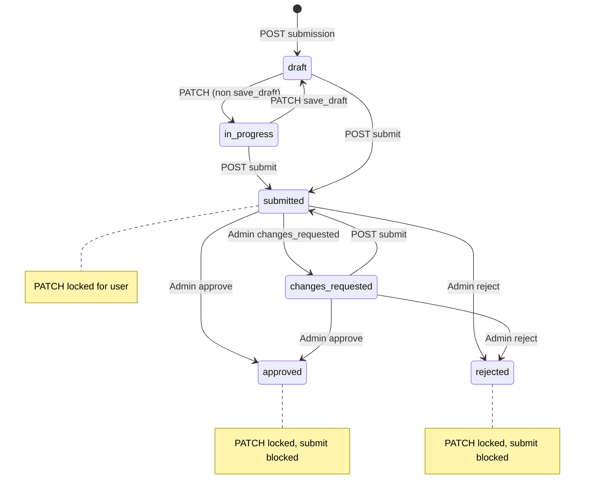

# Property listing (stepper) + admin moderation + S3 uploads — frontend integration guide

This document describes how to integrate the **Abdoun FastAPI** backend for:

- **List Your Property** stepper (user-owned draft → submit)
- **Admin moderation** (list, detail, review)
- **S3 presigned uploads** (binary never goes through PATCH; only `file_name` + `url` in stepper payload)

Copy or symlink this file into your frontend repo as needed. All paths below assume API base **`/api/v1`**.

---

## Table of contents

1. [Base URL and authentication](#1-base-url-and-authentication)
2. [Standard response envelope](#2-standard-response-envelope)
3. [User flow overview](#3-user-flow-overview)
4. [User APIs — property submissions (4 endpoints)](#4-user-apis--property-submissions-4-endpoints)
5. [Stepper steps, PATCH contract, and payload shapes](#5-stepper-steps-patch-contract-and-payload-shapes)
6. [Submission lifecycle and when PATCH / submit are allowed](#6-submission-lifecycle-and-when-patch--submit-are-allowed)
7. [S3 uploads — presigned URL flow](#7-s3-uploads--presigned-url-flow)
8. [Admin APIs — property submission moderation](#8-admin-apis--property-submission-moderation)
9. [End-to-end sequences](#9-end-to-end-sequences)
10. [Error handling tips](#10-error-handling-tips)
11. [Frontend checklist](#11-frontend-checklist)
12. [Validating uploads and public URLs (S3)](#12-validating-uploads-and-public-urls-s3)
13. [Backend environment variables (reference)](#13-backend-environment-variables-reference)
14. [TypeScript types (suggested)](#14-typescript-types-suggested)
15. [Suggested frontend module layout](#15-suggested-frontend-module-layout)

---

## 1. Base URL and authentication

| Item | Value |
|------|--------|
| API prefix | `/api/v1` |
| Example base | `https://<host>/api/v1` |

**Authenticated requests** (user stepper, uploads):

```http
Authorization: Bearer <access_token>
Content-Type: application/json
```

Use the same login/signup flow your app already uses for Abdoun (Cognito/password as configured). The **submitter** must be the authenticated user; submissions are **owner-scoped** (only `submitted_by` can read/patch/submit).

**Admin requests** (moderation):

- Same `Authorization: Bearer <token>` but the token must belong to a user with the **`admin`** role (RBAC).
- Non-admin users receive **403** on admin routes.

---

## 2. Standard response envelope

Successful responses use a common wrapper:

```json
{
  "success": true,
  "data": { },
  "message": null,
  "error": null
}
```

Read **`response.json().data`** for business payloads.

### 2.1 Error responses — do not assume one shape

FastAPI and validation layers do **not** guarantee a single error JSON contract across every endpoint.

| What you may receive | How to handle it |
|----------------------|------------------|
| `{ "detail": "Human-readable string" }` | Show `detail` as a toast or inline banner. |
| `{ "detail": [ { "field": "...", "message": "..." }, ... ] }` | Map entries to form fields when `field` is present; otherwise join messages. |
| Other shapes (proxies, gateways) | Fall back to status text + log response body in dev. |

**Frontend rule:** always branch on **HTTP status** first, then parse `detail` as **either** a string **or** an array (never assume only one). Submit and PATCH validation often return **400** with an array `detail` for per-field errors ([section 10](#10-error-handling-tips) lists typical status codes).

---

## 3. User flow overview

1. User calls **create submission** → receives `submission_id` and initial `status` / `payload` / `step_completion`.
2. User **PATCH**es each step (`step` + `action` + `data`). Payload is **deep-merged** per step; lists in `data` replace that list in the merged step (do not rely on appending without sending full list if your UX needs a full list).
3. For files: **presign → PUT to S3 → PATCH** step with `{ "file_name", "url" }` only (see [section 7](#7-s3-uploads--presigned-url-flow)).
4. User calls **submit** with `confirm_submit: true` → backend validates, writes **normalized** property + media + owners + features, sets submission to **`submitted`**, returns `property_id`.
5. **Admin** reviews (optional): approve / changes_requested / reject.
6. If **`changes_requested`**, the same user can **PATCH** again and **submit** again (status returns to **`submitted`**).

**Frontend UX — `draft` vs `in_progress`:** The API may move a submission from `draft` to `in_progress` after certain PATCHes. For UI, treat `draft` and `in_progress` as the **same bucket** (“user is still editing; not with admin yet”). Do not build separate steppers, routes, or permission logic keyed only on `in_progress` unless product explicitly requires it — that status is mainly a **backend bookkeeping** detail. The diagram below is **authoritative for server rules**; your labels can collapse the two states.



---

## 4. User APIs — property submissions (4 endpoints)

All under: **`/api/v1/property-submissions`**

| Method | Path | Purpose |
|--------|------|---------|
| `POST` | `/property-submissions` | Create draft |
| `GET` | `/property-submissions/{submission_id}` | Load draft + payload |
| `PATCH` | `/property-submissions/{submission_id}` | Save step (`step`, `action`, `data`) |
| `POST` | `/property-submissions/{submission_id}/submit` | Final validate + persist |

### 4.1 Create draft

**POST** `/api/v1/property-submissions`

Optional body:

```json
{ "payload": { } }
```

If `payload` is omitted, server uses defaults. Response `data`:

- `submission_id` (UUID)
- `status` (e.g. `draft`)
- `current_step`, `last_completed_step`, `step_completion`

### 4.2 Get submission

**GET** `/api/v1/property-submissions/{submission_id}`

Response `data` includes full `payload` + `step_completion` + progress fields.

### 4.3 Patch step (save / navigate)

**PATCH** `/api/v1/property-submissions/{submission_id}`

```json
{
  "step": "basic_information",
  "action": "save",
  "data": { }
}
```

**`action`** (enum):

| Value | Meaning |
|-------|---------|
| `save` | Save step; `current_step` updated per server rules |
| `next` | Move forward in step index |
| `previous` | Move backward |
| `save_draft` | When status is `draft` or `in_progress`, forces **`draft`** (backend rule; FE still treats both as “editable draft”) |

**`step`** (enum): one of

`basic_information` → `location` → `owner_information` → `property_details` → `pricing` → `amenities` → `media_documents` → `review_submit`

**PATCH response `data`:** Includes the same **`payload`** object as **GET** (full merged stepper state after this save), plus `submission_id`, `status`, `current_step`, `last_completed_step`, `saved_step`, `step_completion`. The frontend may merge **`data.payload`** into local state (e.g. Redux) **without** treating `current_step` as the active UI step unless you want server-driven navigation—use it only as a source of truth for stored fields and server-side merges (such as owner `documents`).

### 4.4 Submit

**POST** `/api/v1/property-submissions/{submission_id}/submit`

```json
{ "confirm_submit": true }
```

**Idempotency:** If status is already **`submitted`** and `property_id` is set, the same call returns the same `property_id` without duplicating work.

---

## 5. Stepper steps, PATCH contract, and payload shapes

### 5.1 Default payload structure (server-side)

After create (or in GET), `payload` roughly contains:

| Key | Type / notes |
|-----|----------------|
| `basic_information` | object |
| `location` | object |
| `owner_information` | `{ "owners": [] }` |
| `property_details` | object |
| `pricing` | object |
| `amenities` | `{ "feature_ids": [] }` |
| `media_documents` | `{ images[], videos[], documents[], youtube_url, virtual_tour_url }` |
| `review_submit` | object (flags also mirrored on submission row) |

### 5.2 PATCH `data` per step (reference)

Send only the fields you are updating for that step; merge is deep for objects.

**Owner documents vs property documents (do not mix these paths):**

| Kind | Where it lives in `payload` | Presign `context` |
|------|-----------------------------|-------------------|
| **Owner identity / KYC-style documents** (passport, ID, etc.) | `owner_information.owners[].documents` | `owner_document` |
| **Property listing documents** (floor plans, brochures in the media step) | `media_documents.documents` | `property_document` |

Images and videos for the listing live under `media_documents.images` and `media_documents.videos` with their own presign contexts (`property_media_image`, `property_media_video`).

> **Allowed fields on PATCH — backend source of truth**  
> Send **only** the keys the API accepts on each file row. **Extra keys → 400.**
>
> - **`owner_information.owners[].documents[]`:** `file_name`, `url` — nothing else.
> - **`media_documents.images[]`:** `file_name`, `url` (required); optional `is_primary`, `display_order`, `caption`.
> - **`media_documents.videos[]`** and **`media_documents.documents[]`:** `file_name`, `url` (required); optional `display_order`, `caption`. **Do not** send `is_primary` on videos or property documents (rejected with 400).

**`basic_information`**

- Common: `listing_purpose` (`"sale"` \| `"rent"`), `category_id`, `type_id`, `title`, `description`
- If both `type_id` and `category_id` are sent, `type_id` must belong to `category_id` (400 otherwise).

**`location`**

- `city_id`, `area_id`, `address`
- `area_id` must belong to `city_id` when both provided.

**`owner_information`**

- `owners`: array of owner objects.
- Each owner: at least `full_name`; **email or phone** required before submit (PATCH may save partial).
- **Merge behavior:** The API merges **per owner index** (0, 1, …). If a follow-up PATCH sends an `owners` row **without** a `documents` field, **previously saved `documents` for that same index are kept**. If `documents` is sent, new rows are **unioned by `url`** with existing ones; **`documents: []`** clears that owner’s list. (This avoids losing uploads when the UI PATCHes name/phone after a successful S3 flow.)
- **`documents`** (optional per owner): array of **only**:

```json
{ "file_name": "passport.pdf", "url": "https://..." }
```

No `s3_key`, `content_type`, `file_size`, etc. (400 if extra keys).

**`property_details`**

- Numeric fields validated non-negative when present: `bedrooms`, `bathrooms`, `built_up_area`, `parking_spaces`, `property_age`, `total_floors`, etc.

**`pricing`**

- `price`, `currency`, `service_charge`, `maintenance_fee` (non-negative when present).

**`amenities`**

- `feature_ids`: integer array; all IDs must exist.

**`media_documents`**

- **List replace:** If the PATCH body includes `images`, `videos`, or `documents`, that array **replaces** the stored list for that key (same as other steps). After a successful upload, either send the **full** gallery array you want kept or refetch `GET` and merge client-side before PATCH.
- `images[]`: each item **must** include `file_name` and `url`. Optional: `is_primary` (boolean), `display_order` (integer), `caption` (string).
- `videos[]`, `documents[]`: each item **`file_name`**, **`url`**; optional: `display_order` (integer), `caption` (string). **`is_primary` is not allowed** on non-images (400).
- Top-level optional: `youtube_url`, `virtual_tour_url`.

**`review_submit`**

- Booleans: `terms_accepted`, `privacy_accepted`, `public_display_authorized`, `fees_acknowledged`
- PATCHing this step also updates the submission’s stored flags for final submit validation.

### 5.3 Step completion (`step_completion`)

Server maintains `step_completion` per step. Frontend can use it for UI ticks; **submit** still runs full server-side validation regardless.

---

## 6. Submission lifecycle and when PATCH / submit are allowed

### 6.1 Status values

**Frontend UX:** For screens, copy, and disabling logic, group **`draft`** + **`in_progress`** together as “user may still edit; listing not in admin queue yet” (same as [section 3](#3-user-flow-overview)). Reserve distinct UX for **`submitted`**, **`changes_requested`**, **`approved`**, and **`rejected`**.

| Status | Meaning |
|--------|---------|
| `draft` | Initial / explicit draft |
| `in_progress` | Backend: user has applied a non–`save_draft` PATCH (still editable — same UI bucket as `draft` for FE) |
| `submitted` | User submit succeeded; awaiting admin (if applicable) |
| `changes_requested` | Admin sent back for edits |
| `approved` | Terminal (moderation) |
| `rejected` | Terminal (moderation) |

### 6.2 User PATCH

| Status | PATCH allowed? |
|--------|----------------|
| `draft`, `in_progress`, `changes_requested` | Yes |
| `submitted`, `approved`, `rejected` | **No** (409 — locked) |

### 6.3 User submit

| Status | Submit |
|--------|--------|
| `draft`, `in_progress`, `changes_requested` | Allowed (full validation + persist) |
| `submitted` + `property_id` set | **Idempotent** — returns same `property_id` |
| `submitted` + `property_id` null | Server retries persistence (edge recovery) |
| `approved`, `rejected` | **Blocked** (409) |

### 6.4 Presigned upload eligibility

Uploads are **blocked** when submission status is **`approved`** or **`rejected`** (409). Otherwise owner must match `submission_id`.

---

## 7. S3 uploads — presigned URL flow

Binary files **must not** be sent to `PATCH /property-submissions/...`. Use:

**POST** `/api/v1/uploads/presigned-url`

> **`url` is a storage identifier, not always a “shareable preview” link**  
> The `url` string returned from presign is what you **persist** in PATCH and what the backend may later copy into `property_media` / owner JSON. On **private** buckets it often **does not** work as anonymous `` or “paste in browser” — S3 may respond with **`AccessDenied`**, which can still mean the upload succeeded. Treat **PUT 2xx** + **GET submission shows the same `url`** as success; see [7.5](#75-why-opening-url-in-the-browser-can-show-accessdenied). If the product needs in-app thumbnails for private objects, plan **signed GET**, **CloudFront**, or a **backend proxy** (not in this API today).

### 7.1 Request

```json
{
  "submission_id": "<uuid>",
  "context": "owner_document",
  "file_name": "passport.pdf",
  "content_type": "application/pdf",
  "file_size": 123456
}
```

| Field | Required | Notes |
|-------|----------|--------|
| `submission_id` | Yes | Must belong to current user |
| `context` | Yes | See table below |
| `file_name` | Yes | Extension validated against env allowlists |
| `content_type` | Yes | Must match category (image/*, video/*, or general mime for documents) |
| `file_size` | No | If sent, must be within max MB for that context (validation only; **not stored** in submission) |

**`context`** values:

| `context` | Use for | Typical `content_type` prefix |
|-------------|---------|-------------------------------|
| `owner_document` | Owner step documents | e.g. `application/pdf` |
| `property_media_image` | Media step images | `image/*` |
| `property_media_video` | Media step videos | `video/*` |
| `property_document` | Media step property documents | e.g. `application/pdf` |

Allowed extensions and max sizes come from backend env (e.g. `ALLOWED_PROPERTY_IMAGE_EXTENSIONS`, `PROPERTY_IMAGE_MAX_SIZE_MB`, etc.).

**Documents:** Both **`owner_document`** and **`property_document`** use the same env list **`ALLOWED_PROPERTY_DOCUMENT_EXTENSIONS`** (default in code is `.pdf,.doc,.docx` if unset). If your deploy sets this to only `pdf`, Word uploads will return **400** until you add `doc,docx` (or `.doc,.docx`).

**Extension lists in `.env`:** You may use either `jpg,jpeg` or `.jpg,.jpeg` — the API normalizes to a leading dot when matching `file_name` (e.g. `photo.jpg` → suffix `.jpg`).

**400 `Unsupported file extension …`:** The response body lists the **upload `context`** and the **allowed** extensions for that context (from the server env). Align the file picker / accept attribute with that list, or ask ops to widen the allowlist.

### 7.2 Response (`data`)

```json
{
  "upload_url": "<presigned PUT URL>",
  "url": "<permanent object URL string — may not allow anonymous GET>",
  "expires_in": 900
}
```

- **`upload_url`**: use as **PUT** target from the browser or app (direct to S3 / compatible endpoint).
- **`url`**: persist this string in stepper PATCH as `url` next to `file_name`. This is the **canonical location** of the object; it is **not** a promise that the object is world-readable in a browser.
- **`s3_key` is not returned** by design; do not rely on it in the client.

### 7.3 Client upload (PUT)

1. `POST /uploads/presigned-url` with JSON body.
2. **PUT** `upload_url` with raw **binary** body.
3. Set header **`Content-Type`** exactly to the same value you sent to presign (must match signature).
4. No `Authorization` header on PUT unless your infra adds it (standard AWS presigned PUT does not use your API JWT).

### 7.4 Then PATCH stepper

Use **`url`** from presign response + human **`file_name`** in owner or media step (see [5.2](#52-patch-data-per-step-reference)).

### 7.5 Why opening url in the browser can show AccessDenied

The `url` field is the **stable object address** (for storing in your DB / stepper payload). It is **not** a guarantee that the bucket allows **anonymous HTTP GET**.

Typical setup:

- Presigned **PUT** → only the holder of `upload_url` can upload for a short time.
- Object and bucket remain **private** → pasting `url` in Chrome returns S3 XML **`AccessDenied`** — this is **expected**, not a bug in presign.

To **prove** an upload succeeded, use one of:

- **AWS S3 console**: object appears under `drafts/property-submissions/{submission_id}/...`
- **AWS CLI**: `aws s3api head-object --bucket <bucket> --key "<key from url path>"`
- **Authenticated download** (app/backend or CLI with IAM), not incognito GET on raw S3 URL

If product requires **in-browser preview** of private objects, use **CloudFront signed URLs**, a **backend proxy**, or **presigned GET** (not part of this API contract today) — coordinate with infra.

### 7.6 `fetch` example (browser / RN)

```ts
// 1) Presign (with your API JWT)
const presign = await api.post("/uploads/presigned-url", { ... });

// 2) Upload binary to S3 (no Bearer)
const file: File = ...;
await fetch(presign.data.upload_url, {
  method: "PUT",
  headers: { "Content-Type": file.type }, // must match presign body content_type
  body: file,
});

// 3) Save metadata on stepper only
await api.patch(`/property-submissions/${submissionId}`, {
  step: "owner_information",
  action: "save",
  data: { owners: [{ ..., documents: [{ file_name: file.name, url: presign.data.url }] }] },
});
```

### 7.7 Failed to fetch on PUT to S3 and bucket CORS

If `POST /uploads/presigned-url` returns **200** but the next **`fetch(upload_url, { method: "PUT", ... })`** fails with **`TypeError: Failed to fetch`**, DevTools often shows **“Provisional headers are shown”** and **no response** from S3. That usually means the browser **blocked** the request before it completed — most commonly **missing or wrong CORS rules on the S3 bucket** for your frontend origin (`http://localhost:3000`, production app URL, etc.).

**Fix (infrastructure):** In AWS S3 → your assets bucket → **Permissions** → **Cross-origin resource sharing (CORS)** — add a configuration that allows **`PUT`** (and **`GET`/`HEAD`** if you ever read from the browser) from the exact origins you use. Example for local + one production host:

```json
[
  {
    "AllowedHeaders": ["*"],
    "AllowedMethods": ["PUT", "GET", "HEAD"],
    "AllowedOrigins": [
      "http://localhost:3000",
      "http://127.0.0.1:3000",
      "https://your-production-app.example.com"
    ],
    "ExposeHeaders": ["ETag"],
    "MaxAgeSeconds": 3600
  }
]
```

Tighten `AllowedHeaders` / `AllowedOrigins` to the minimum your security model allows. After saving CORS, retry the upload (hard refresh). This cannot be fixed by changing **FastAPI CORS** alone — the **S3** endpoint enforces CORS for the browser → S3 request.

**Frontend checks (same failure mode if wrong):**

- Do **not** send your API **`Authorization`** header on the S3 `PUT` (only `Content-Type` + body, unless your signing flow explicitly adds other headers — then those names must appear in CORS `AllowedHeaders`).
- Use **`Content-Type`** on the PUT **exactly** equal to the `content_type` sent to presign (including `application/pdf` vs `application/x-pdf` if the browser reports something unusual — normalize before presign and reuse the same string on PUT).
- Prefer **`credentials: "omit"`** (default for `fetch` without cookies) on the S3 request; `credentials: "include"` with `Access-Control-Allow-Origin: *` on S3 will fail.
- If the app is served over **HTTPS**, do not call presigned URLs that downgrade to **HTTP**.

---

## 8. Admin APIs — property submission moderation

All under: **`/api/v1/admin/property-submissions`**  
**Auth:** Bearer token for user with **`admin`** role.

| Method | Path | Purpose |
|--------|------|---------|
| `GET` | `/admin/property-submissions` | Paginated list |
| `GET` | `/admin/property-submissions/{submission_id}` | Full detail including `payload` |
| `POST` | `/admin/property-submissions/{submission_id}/review` | Approve / changes / reject |

### 8.1 List query params

- `status` (optional): `submitted` \| `changes_requested` \| `approved` \| `rejected`
- `page` (default 1, ≥ 1)
- `limit` (default 10, max 200)

Response `data`:

```json
{
  "items": [
    {
      "submission_id": "...",
      "submitted_by": "...",
      "status": "submitted",
      "property_id": "...",
      "current_step": 8,
      "submitted_at": "...",
      "reviewed_at": null
    }
  ],
  "page": 1,
  "limit": 10,
  "total": 25
}
```

### 8.2 Review body

```json
{ "action": "approve" }
```

```json
{ "action": "changes_requested", "reason": "Missing ownership document" }
```

```json
{ "action": "reject", "reason": "Invalid property details" }
```

Rules:

- **`reason`** required for `changes_requested` and `reject`; optional for `approve`.
- Cannot review **`draft`** / **`in_progress`** (409).
- Cannot review again when already **`approved`** or **`rejected`** (409).

After **`changes_requested`**, the **owner** can PATCH again and submit again → status **`submitted`**.

---

## 9. End-to-end sequences

### 9.1 New listing (happy path)

1. `POST /property-submissions` → store `submission_id`.
2. For each step, `PATCH ...` with merged `data` (or full step object as you prefer).
3. For each file: `POST /uploads/presigned-url` → `PUT upload_url` → `PATCH` owner or media with `{ file_name, url }`.
4. `POST .../submit` with `{ "confirm_submit": true }` → store `property_id`.
5. (Optional) Admin: `GET` list → `GET` detail → `POST` review.

### 9.2 Resubmit after admin changes

1. Admin: `POST .../review` with `changes_requested` + `reason`.
2. User: `GET` submission (still same `submission_id`) → adjust payload via **PATCH** (allowed in `changes_requested`).
3. User: `POST .../submit` again → status **`submitted`** again.

---

## 10. Error handling tips

| HTTP | Typical cause |
|------|----------------|
| 400 | Validation (PATCH step rules, submit field errors, upload extension/type/size) |
| 401 | Missing/invalid JWT |
| 403 | Admin route without admin role |
| 404 | Wrong `submission_id` or not owner (user routes hide existence) |
| 409 | PATCH/submit/review not allowed for current status |
| 500 | Server / misconfigured S3 bucket, etc. |

**Parsing `detail`:** See [2.1](#21-error-responses--do-not-assume-one-shape). For **submit** and PATCH validation failures, prefer mapping **array** `detail` entries to fields; for **string** `detail`, show a single message.

---

## 11. Frontend checklist

**Stepper (owner user)**

- [ ] Store `submission_id` after create; refetch `GET` after cold start / deep link.
- [ ] Treat `draft` and `in_progress` as one editable state in UI; do not branch critical UX only on `in_progress`.
- [ ] Implement all 8 steps + `review_submit`; align UI order with server `STEP_ORDER` ([section 5](#5-stepper-steps-patch-contract-and-payload-shapes)).
- [ ] Use `action` consistently: `save`, `next`, `previous`, `save_draft` ([section 4.3](#43-patch-step-save--navigate)).
- [ ] **Files:** implement `presign → PUT(S3) → PATCH` only; never send file bytes to PATCH.
- [ ] Owner KYC docs → `owner_information.owners[].documents`; property docs in media step → `media_documents.documents` ([5.2](#52-patch-data-per-step-reference)).
- [ ] PATCH file entries: respect the **allowed fields** callout in [5.2](#52-patch-data-per-step-reference) (no `s3_key`, `content_type`, `file_size` on PATCH).
- [ ] Match presign `content_type` to PUT `Content-Type` and to real file type.
- [ ] Disable stepper **PATCH** when status is `submitted`, `approved`, or `rejected` (409).
- [ ] When status is `changes_requested`, show admin `review_reason` if returned elsewhere in your UI; allow PATCH + submit again.
- [ ] Submit: send `{ "confirm_submit": true }`; handle **idempotent** success if user double-clicks (same `property_id`).
- [ ] Map submit **400** `detail` to UI: support **both** string and array shapes ([2.1](#21-error-responses--do-not-assume-one-shape)).

**Admin**

- [ ] Gate admin UI on **`admin`** role (or equivalent from your auth payload).
- [ ] Use admin JWT for `GET /admin/property-submissions` and review endpoints only.
- [ ] After listing, open detail by `submission_id`; review actions require `reason` for reject / changes_requested.

**S3 / UX**

- [ ] If PUT shows **Failed to fetch** / provisional headers: fix **S3 bucket CORS** for your app origin ([7.7](#77-failed-to-fetch-on-put-to-s3-and-bucket-cors)); not API CORS alone.
- [ ] S3 `PUT`: no API Bearer; `Content-Type` matches presign; avoid `credentials: "include"` unless CORS is explicitly configured for it.
- [ ] Do not treat “browser opens `url`” as success criteria on private buckets ([7.5](#75-why-opening-url-in-the-browser-can-show-accessdenied)).
- [ ] Optional: show “uploaded” after PUT returns 2xx; optional head-object from a **backend** admin tool if needed.

---

## 12. Validating uploads and public URLs (S3)

| Step | What to check |
|------|----------------|
| Presign | `POST /uploads/presigned-url` returns **200** and `data.upload_url`, `data.url`, `data.expires_in`. |
| PUT | Response **2xx** from S3; wrong `Content-Type` or body often yields **403** from S3. |
| PATCH | `GET /property-submissions/{id}` shows `documents` / `images` with same `url` you stored. |
| Submit | Completes without 400; `property_id` returned. |
| DB / product | `property_media.url` and owner JSON contain the URL string (backend responsibility after submit). |

**Quick manual regression (Postman)**

1. Create submission → copy `submission_id`.
2. Presign → **PUT** `upload_url` with binary file.
3. PATCH owner (or media) with `{ file_name, url }`.
4. GET submission → confirm payload.
5. Complete remaining steps + submit → 200 + `property_id`.
6. (Optional) Admin list → get → approve.

---

## 13. Backend environment variables (reference)

These are read by the **backend** (not exposed to the browser). Frontend only needs to know behavior (extensions, max sizes enforced on presign when `file_size` is sent).

| Variable | Role |
|----------|------|
| `AWS_ACCESS_KEY_ID`, `AWS_SECRET_ACCESS_KEY` | S3 signing (or use IAM role on deploy) |
| `AWS_REGION` | Region for boto3 and default public URL shape |
| `AWS_S3_BUCKET` | Target bucket |
| `AWS_S3_ENDPOINT_URL` | Optional; set for S3-compatible endpoints; leave empty for AWS |
| `AWS_S3_PUBLIC_BASE_URL` | Optional; if set, `url` in presign uses this base + key |
| `AWS_S3_PRESIGNED_EXPIRY` | TTL seconds for PUT URL (default often 900) |
| `AWS_S3_USE_PRESIGNED_URL` | Present in config; upload flow uses presigned PUT |
| `PROPERTY_*` (video/image/document limits, codec, flags) | Mostly validation / future use; **presign** uses image/video/document max MB when `file_size` sent |
| `ALLOWED_PROPERTY_*_EXTENSIONS` | Comma-separated; with or without leading `.` |

---

## 14. TypeScript types (suggested)

```ts
// API wrapper
export type ApiSuccess<T> = {
  success: true;
  data: T;
  message: string | null;
  error: null;
};

// Steps / actions (mirror backend literals)
export type SubmissionStep =
  | "basic_information"
  | "location"
  | "owner_information"
  | "property_details"
  | "pricing"
  | "amenities"
  | "media_documents"
  | "review_submit";

export type SubmissionAction = "save" | "next" | "previous" | "save_draft";

export type PatchBody = {
  step: SubmissionStep;
  action: SubmissionAction;
  data: Record<string, unknown>;
};

/** PATCH /property-submissions/{id} success body */
export type PropertySubmissionPatchResult = {
  submission_id: string;
  status: string;
  current_step: number;
  last_completed_step: number;
  saved_step: SubmissionStep;
  step_completion: Record<string, boolean>;
  /** Same shape as GET — merge into wizard state; optional: ignore current_step for active tab */
  payload: Record<string, unknown>;
};

// Presign
export type UploadContext =
  | "owner_document"
  | "property_media_image"
  | "property_media_video"
  | "property_document";

export type PresignRequest = {
  submission_id: string;
  context: UploadContext;
  file_name: string;
  content_type: string;
  file_size?: number;
};

export type PresignResponse = {
  upload_url: string;
  url: string;
  expires_in: number;
};

// Minimal file rows in PATCH payload
export type OwnerDocumentRef = { file_name: string; url: string };

export type MediaImageRef = OwnerDocumentRef & {
  is_primary?: boolean;
  display_order?: number;
  caption?: string;
};

export type MediaVideoOrDocRef = OwnerDocumentRef & {
  display_order?: number;
  caption?: string;
};

// Admin
export type AdminReviewAction = "approve" | "changes_requested" | "reject";
export type AdminReviewBody = { action: AdminReviewAction; reason?: string | null };
```

---

## 15. Suggested frontend module layout

Keep HTTP thin; one place for URLs and typing.

```
src/
  api/
    propertySubmissions.ts   // create, get, patch, submit
    uploads.ts               // postPresignedUrl only
    adminPropertySubmissions.ts // list, get, review (admin token)
  features/
    listProperty/
      steps/                  // one component or module per step
      useSubmissionState.ts   // loads GET, merges PATCH optimistically if you want
      useS3Upload.ts          // presign + PUT + return { file_name, url }
```

`useS3Upload.ts` should:

1. Call presign with **same** `content_type` you will use on PUT.
2. `PUT` binary.
3. Return `{ file_name, url }` for the caller to embed in PATCH `data`.

---

## Document maintenance

When backend routes or validation rules change, update this file in the **abdoun_fast_api** repo and re-copy to the frontend repo, or maintain a single shared wiki link.

**Backend source of truth** (for contributors):

- Routes: `app/api/v1/routes/property_submissions.py`, `uploads.py`, `admin_property_submissions.py`
- Schemas: `app/schemas/property_submission.py`, `app/schemas/uploads.py`
- Logic: `app/services/property_submission_service.py`, `app/services/upload_service.py`
